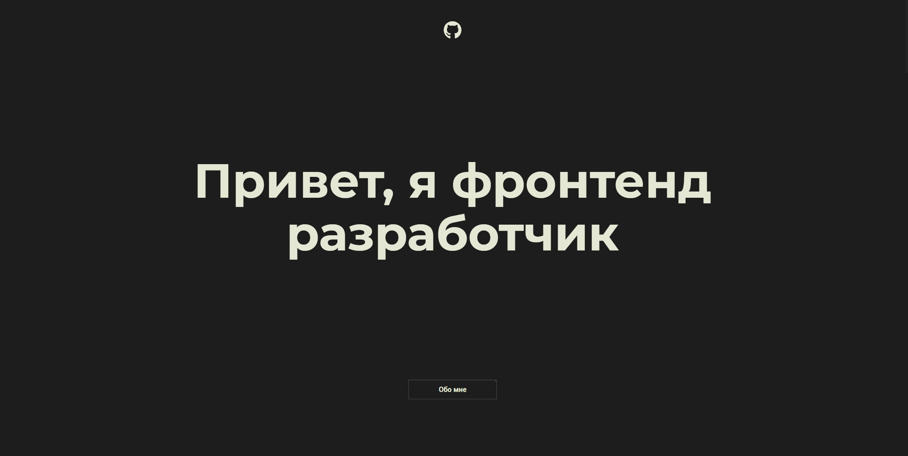

# Портфолио

## Простой Landing Page: Полигон для Тренировок
URL: <a href="https://portfolio-arshtnkv.vercel.app/" target="_blank">portfolio-arshtnkv.vercel.app</a>

### Технологии:
- PUG
- SASS
- Java Script (ECMAScript 6)
- Gulp, Webpack
- PHP, PHPMailer

### Наполнение:
- Обо мне
- Мой опыт
- Примеры работ
- Связаться со мной

<br clear="both">

<div>
  
</div>

### Основные команды для работы:

- Установка 
```
npm i
```

- Запуск локального сервера без минификаций
```
npm start
```

- Запуск локального сервера c минификациями, <br>
данный вариант не используется в разработке, <br>
он нужен только для тестов производительности <br>
на локальном хосте
```
npm run dev
```

- Сборка проекта, минификация скриптов <br>
и оптимизация изображений перед деплоем на прод
```
npm run build
```

- Запуск тестирования на соответствия кодгайдам
```
npm test
```

- Создание webp изображений в директории source
```
npm run webp
```

### Вся разработка ведётся в директории `source`
### Итоговый код попадает в директорию `build`
